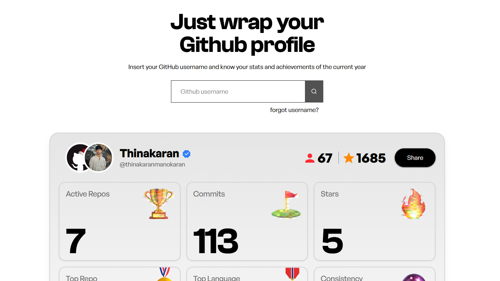

# GitHub Wrapper 🚀

<p align="center">
  <picture>
    <source media="(prefers-color-scheme: dark)" srcset="public/dark-favicon/favicon1000.png">
    
  </picture>
</p>
> **Your GitHub Year in Review — beautifully wrapped.**

GitHub Wrapper is a web application that generates a **GitHub Wrapped-style summary** of your year in open source. Just enter a GitHub username and instantly get a shareable card showing commits, repositories, stars, top languages, consistency, and achievement badges.

🔗 **Live Site:** [https://thinakaranmanokaran.github.io/github_wrapper](https://thinakaranmanokaran.github.io/github_wrapper)
📦 **Repository:** [https://github.com/thinakaranmanokaran/github_wrapper](https://github.com/thinakaranmanokaran/github_wrapper)

---

## ✨ Features

* 🔍 Search any GitHub username
* 📊 Year-wise GitHub stats (current year)
* 📦 Active repositories count
* 🧠 Total commits
* ⭐ Stars gained
* 🏆 Top contributed repository
* 🌍 Most used programming language
* 🔥 Most active month (consistency)
* 🎖️ Dynamic achievement badges
* 🖼️ Downloadable share card (PNG)
* 🔗 Share profile via link
* 🌗 Light & Dark mode favicons
* ⚡ Fast & responsive UI

---

## 🖼️ Preview



---

## 🛠️ Tech Stack

* **Frontend:** React + Vite
* **Styling:** Tailwind CSS
* **Icons:** React Icons
* **Image Export:** html-to-image
* **API:** GitHub REST API v3
* **Hosting:** GitHub Pages

---

## 📂 Project Structure

```
github_wrapper/
├── public/
│   ├── dark-favicon/
│   ├── light-favicon/
│   ├── preview.png
│   └── index.html
├── src/
│   ├── components/
│   ├── assets/
│   ├── pages/
│   ├── App.jsx
│   └── main.jsx
└── README.md
```

---

## 🚀 Getting Started

### 1️⃣ Clone the repository

```bash
git clone https://github.com/thinakaranmanokaran/github_wrapper.git
cd github_wrapper
```

### 2️⃣ Install dependencies

```bash
npm install
```

### 3️⃣ Create `.env` file

```env
VITE_GITHUB_API=https://api.github.com
VITE_GITHUB_TOKEN=your_personal_access_token
```

> ⚠️ GitHub token is optional but recommended to avoid API rate limits.

### 4️⃣ Run locally

```bash
npm run dev
```

Open `http://localhost:5173`

---

## 🧮 Stats Calculation Logic

GitHub Wrapper calculates:

* Commits from **Jan 1 → Current Date**
* Stars gained on repos created this year
* Active repos based on commit activity
* Top languages via repository language bytes
* Consistency via monthly commit distribution

---

## 🏅 Achievement Badges

Badges are awarded based on thresholds:

* 🧠 **Brainstormer** — 100+ commits
* 🏆 **Code Machine** — 500+ commits
* 👑 **Commit Emperor** — 1000+ commits
* 🛠️ **Marvelous Maker** — 3+ active repos
* 🐯 **Champion Tiger** — 10+ active repos
* 🐐 **The GOAT** — 25+ active repos
* 🌍 **Polyglot Dev** — 5+ languages
* ⭐ **Community Favorite** — 100+ stars
* 🌟 **Open Source Royalty** — 500+ stars
* 🔥 **Momentum Monk** — consistent activity

---

## 📸 Download & Share

* Download your GitHub Wrapped card as **PNG**
* Copy shareable profile link
* Share directly via native share menu

---

## 🔐 API Rate Limits

* Without token: **60 requests/hour**
* With token: **5000 requests/hour**

Using a token is highly recommended for accurate stats.

---

## 🧠 Known Limitations

* GitHub API limits commit history per repo
* Private repository data not included
* Large accounts may take a few seconds to load

---

## 👨‍💻 Developer

**Thinakaran Manokaran**

* 🌐 Portfolio: [https://thinakaran.dev](https://thinakaran.dev)
* 🐙 GitHub: [https://github.com/thinakaranmanokaran](https://github.com/thinakaranmanokaran)
* 🐦 Twitter/X: [https://twitter.com/thinakaranmano](https://twitter.com/thinakaranmano)

---

## 🤝 Contributing

Contributions, issues, and feature requests are welcome!

1. Fork the project
2. Create your feature branch (`git checkout -b feature/AmazingFeature`)
3. Commit your changes (`git commit -m 'Add amazing feature'`)
4. Push to the branch (`git push origin feature/AmazingFeature`)
5. Open a Pull Request

---

## 📄 License

This project is licensed under the **MIT License**.

---

⭐ If you like this project, give it a star and share it with the community!
